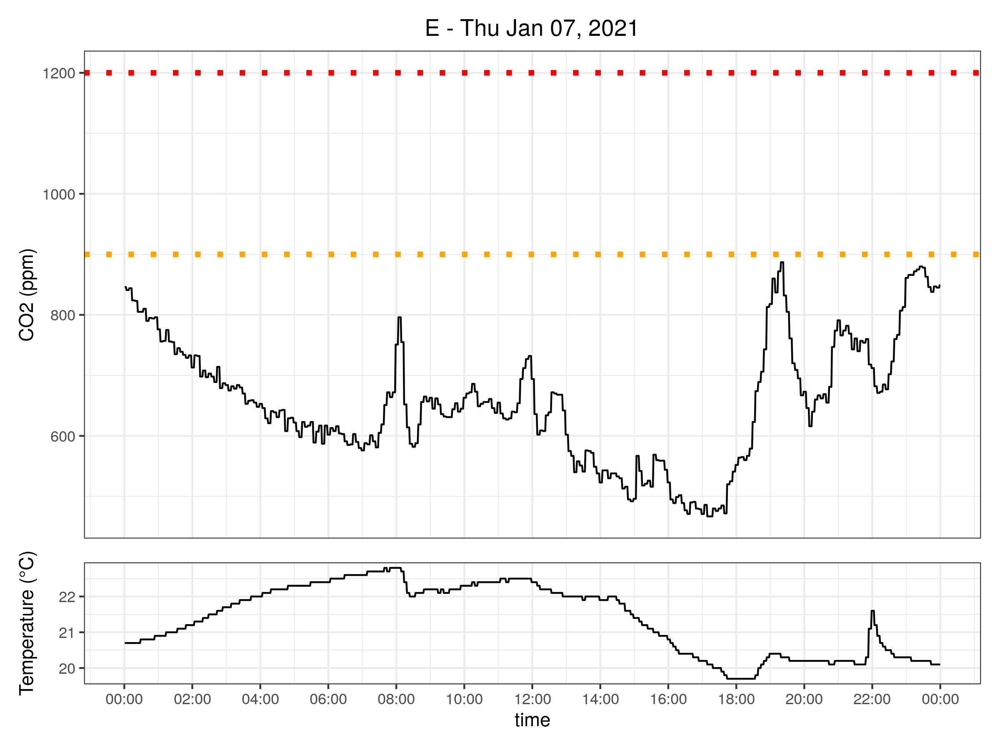

# co2plot

This little tool creates a plot of the readouts of an [Aranet4](https://aranet4.com/) CO2 meter for 1 day. It's basically a shell script that uses [Docker](https://www.docker.com) for making sure all dependencies are available.

## Background

The source for generating the plot is available under `src/`. At Data Intuitive, are developing a tool called `viash` to convert this R code into a runnable script. Viash itself is not yet Open Source (but will soon be).

The resulting script can be found under `bin/`.

## Prerequisites

Docker is used for loading an environment that contains the relevant R libraries and stuff.

The tool should be run from the CLI: Linux, MacOS and Windows with WSL are supported.

## Use

In order to use co2plot, download `bin/co2plot`. The easiest approach is probably by cloning the repo (or downloading it as a [zip file](https://github.com/tverbeiren/co2plot/archive/main.zip)).

Unpack the repository and open a terminal in the co2plot directory. Running the included example is as simple as:

```sh
bin/co2plot ---setup
bin/co2plot -w example -d 07012021
```

A file called [`example-2021-01-07.pdf`](output/example-2021-01-07.pdf) will be created containing the plot.

Co2plot will look inside the `example` directory (given by the option `-w`) for csv data files. It will parse them all, remove duplicate entries and select a specific day (using `-d`) which in this case is 7/1/2021. If you have multiple meters, just create directories for every meter and specify the one of interest here.

The resulting file contains the identifier `example` and the title takes the first letter of that (in order not to share too much information when copy/pasting the plot).

If the directory containing the data is located elsewhere or is called differently, the `-i` option may be of interest. Also, if you intend to use `png` as a file format, `-f png` can be provided as an option.



In order to get an overview of all possible options, use:

```sh
bin/co2plot -h
```
